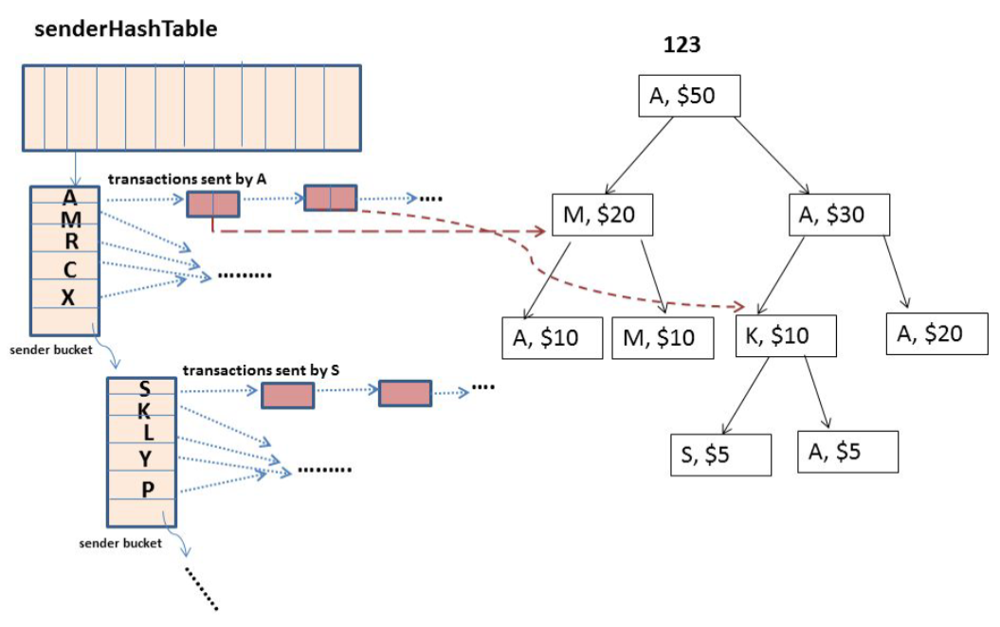

# Simulation of Bitcoin transactions #
## Input ##
Command line arguments should be given as it follows (order doesn't matter as long as flags are correct):
```
./bitcoin -a bitCoinBalancesFile –t transactionsFile -v bitCoinValue –h1 senderHashtableNumOfEntries –h2 receiverHashtableNumOfEntries –b bucketSize
```
where : <br>
* **bitCoinValue** is the value of a bitcoin in dollars ($).
* **bitCoinBalancesFile** is the file with user names and the ids of the bitcoins they own. You can use files in test_files folder. <br>
* **transactionsFile** is the file with the transactions between users. <br> 
Each line of the file has the following format: transactionId, senderWalletId, receiverWalletId, transferredValue, date, time (without commas)<br>
e.g. <br>
889 Maria Ronaldo 50 25-12-2018 20:08 <br>
You can use files in test_files folder. <br>
* **senderHashtableNumOfEntries** and **receiverHashtableNumOfEntries** are number of cells for hashtable that will store users and their transactions. (Hashtable with buckets, walletId is hashed and for each wallet keeps a list of its transactions).
* **bucketSize** is the size of each bucket of the hashtable in bytes.

## Structures ##
**Hashtable, list and tree have been impemented as generic structs (with void \*) as data to be reused anywhere.**
Two hashtables (for senders and receivers of transactions) with buckets. WalletId (which is the name of the user) is being hashed and for each entry there is a list of the transactions where this wallet is sending (if senderHashtable) or receiving (receiverHashtable) money.
A hashtable with wallet information. WalletId is being hashed.
A hashtable with bitcoins. BitcoinId is being hashed.
A binary tree for every bitcoin (every entry in the bitcoin hashtable has a pointer to such a tree). The tree keeps track of all transactions this bitcoins has been involved in. Each node of the tree has the walletId of the receiver or sender of the transaction and the part of the value of the bitcoin that was transferred. <br> <br>


## Program Commands ##
Main function always asks for a user command from the following list of possible commands: <br>
* listCommands : List all the possible commands the user can give.
```
Please enter a command: listCommands

- Request a transaction (optionally date and time) :
        requestTransaction senderWalletID receiverWalletID amount [date] [time]

- Request multiple transactions (optionally date and time) :
        requestTransactions senderWalletID receiverWalletID amount [date] time;
        senderWalletID2 receiverWalletID2 amount2 [date2] [time2];
        ...
        senderWalletIDn receiverWalletIDn amountn [daten] [timen];

- Read transactions from an input file as :
        requestTransactions inputFile

- Show received earnings of a certain user (optionally in a certain time period) :
​       findEarnings walletID [time1][year1][time2][year2]

- Show sent payments of a certain user (optionally in a certain time period) :
​       findPayments walletID [time1][year1][time2][year2]

- Show balance in a certain wallet :
​       walletStatus walletID

- Show info about a certain bitcoin :
        bitCoinStatus bitCoinID

- Show transaction history of a certain bitcoin :
        traceCoin bitCoinID

FOR DEBUGGING PURPOSES: 

- Show wallets' hashtable :
        showWallets

- Show senders' transactions hashtable :
        showSenders

- Show receivers' transactions hashtable :
        showReceivers

- Show bitcoins hashtable :
        showBitcoins

- Show bitcoin shares of a certain wallet :
        showBitcoinShares walletID

- Show transactions tree of a certain bitcoin :
        showBitcoinTree bitCoinID

- List all possible commands :
        listCommands

- Exit program: 
        exit

```
* requestTransaction senderWalletID receiverWalletID amount date time : Transfer the given amount of money from sender to receiver wallet. Date and time are optional and if given they should be later than the most recent transaction. If they are not given, current date and time are used. 
```
Please enter a command: requestTransaction johnsmith richard 30

Successful transaction.
```
<!-- * requestTransactions senderWalletID1 receiverWalletID1 amount1 date1 time1;
senderWalletID2 receiverWalletID2 amount2 date2 time2;
senderWalletID3 receiverWalletID3 amount3 date3 time3; <br> : Same as above but with multiple transactions seperated by semicolon. -->
* requestTransactions inputfile : same as above but transactions multiple and from an input file.
```
Please enter a command: requestTransactions test_files/transactionsFile3.txt   

Successful transaction.
Successful transaction.
```
* findEarnings walletID time1 year1 time2 year2 : Find total amount of money received from wallet with walletId time and year are optional and show the time window to find earning in. Also transactions where walletId was a receiver will be printed (in the time window if given).
```
Please enter a command: findEarnings richard

Received transactions :
        4 blockchainguy richard 40 30-09-2019 12:10
        1 norvaldach richard 34 12-08-2018 23:00

Total earnings of richard : $74
```
* findPayments walletID time1 year1 time2 year2 : Same as above but walletId is sender.
```
Please enter a command: findPayments blockchainguy

Sent transactions :
        4 blockchainguy richard 40 30-09-2019 12:10
        3 blockchainguy hackerman 40 30-09-2019 12:10

Total payments of blockchainguy : $80
```
* walletStatus walletId : Print current balance of wallet with given walletId.
```
Please enter a command: walletStatus richard

WalletID: richard, Balance: $574
```
* bitCoinStatus bitCoinID : Print initial value of bitcoin with given bitcoinId, the value of the bitcoin that has not been involved in any transactions and the number of transactions the bitcoin has been involved in. 
```
Please enter a command: bitCoinStatus 448

BitcoinID: 448, Unspent: $20, Number of transactions: 2
```
* traceCoin bitCoinID : Print history of transactions of the bitcoin with given bitCoinId.
```
Please enter a command: traceCoin 448

3 blockchainguy hackerman 40 30-09-2019 12:10
4 blockchainguy richard 40 30-09-2019 12:10
```
* showWallets : Print all wallet Ids and the structure of the wallet hashtable.
```
Please enter a command: showWallets

- In hashtable entry 0: 
        In bucket 0: 
                WalletID: iknowwhatyoudidlastsummer, Balance: $200
                WalletID: blockchainguy, Balance: $200
- In hashtable entry 1: 
- In hashtable entry 2: 
- In hashtable entry 3: 
        In bucket 0: 
                WalletID: norvaldach, Balance: $100
- In hashtable entry 4: 
- In hashtable entry 5: 
- In hashtable entry 6: 
- In hashtable entry 7: 
        In bucket 0: 
                WalletID: gladysshanahan, Balance: $300
- In hashtable entry 8: 
- In hashtable entry 9: 
        In bucket 0: 
                WalletID: jamaalaufderhar, Balance: $200
- In hashtable entry 10: 
        In bucket 0: 
                WalletID: richard, Balance: $500
- In hashtable entry 11: 
- In hashtable entry 12: 
- In hashtable entry 13: 
        In bucket 0: 
                WalletID: imwatchingyou, Balance: $400
- In hashtable entry 14: 
        In bucket 0: 
                WalletID: lookingforagoogusernametoo, Balance: $0
- In hashtable entry 15: 
- In hashtable entry 16: 
        In bucket 0: 
                WalletID: annie, Balance: $300
                WalletID: lookingforagoogusername, Balance: $300
                WalletID: crystalsmith, Balance: $100
                WalletID: shirleysparkerlittlewallet, Balance: $0
- In hashtable entry 17: 
        In bucket 0: 
                WalletID: johnsmith, Balance: $400
- In hashtable entry 18: 
        In bucket 0: 
                WalletID: oneofthemanybitcoinminersforfreeinternet, Balance: $400
- In hashtable entry 19: 
        In bucket 0: 
                WalletID: hackerman, Balance: $100
```
* showBitcoins : Print all bitcoin Ids and the structure of the bitcoin hashtable.
```
Please enter a command: showBitcoins

- In hashtable entry 0: 
        In bucket 0: 
                BitcoinID: 740, Unspent: $100, Number of transactions: 0
                BitcoinID: 440, Unspent: $100, Number of transactions: 0
- In hashtable entry 1: 
        In bucket 0: 
                BitcoinID: 541, Unspent: $100, Number of transactions: 0
                BitcoinID: 321, Unspent: $100, Number of transactions: 0
                BitcoinID: 901, Unspent: $100, Number of transactions: 0
                BitcoinID: 721, Unspent: $100, Number of transactions: 0
                BitcoinID: 681, Unspent: $100, Number of transactions: 0
- In hashtable entry 2: 
- In hashtable entry 3: 
        In bucket 0: 
                BitcoinID: 123, Unspent: $100, Number of transactions: 0
- In hashtable entry 4: 
        In bucket 0: 
                BitcoinID: 904, Unspent: $100, Number of transactions: 0
                BitcoinID: 744, Unspent: $100, Number of transactions: 0
- In hashtable entry 5: 
        In bucket 0: 
                BitcoinID: 325, Unspent: $100, Number of transactions: 0
- In hashtable entry 6: 
- In hashtable entry 7: 
        In bucket 0: 
                BitcoinID: 387, Unspent: $100, Number of transactions: 0
                BitcoinID: 687, Unspent: $100, Number of transactions: 0
                BitcoinID: 767, Unspent: $100, Number of transactions: 0
- In hashtable entry 8: 
        In bucket 0: 
                BitcoinID: 428, Unspent: $100, Number of transactions: 0
                BitcoinID: 448, Unspent: $100, Number of transactions: 0
                BitcoinID: 728, Unspent: $100, Number of transactions: 0
- In hashtable entry 9: 
        In bucket 0: 
                BitcoinID: 869, Unspent: $100, Number of transactions: 0
- In hashtable entry 10: 
        In bucket 0: 
                BitcoinID: 670, Unspent: $100, Number of transactions: 0
                BitcoinID: 5490, Unspent: $100, Number of transactions: 0
                BitcoinID: 430, Unspent: $100, Number of transactions: 0
- In hashtable entry 11: 
        In bucket 0: 
                BitcoinID: 431, Unspent: $100, Number of transactions: 0
- In hashtable entry 12: 
        In bucket 0: 
                BitcoinID: 432, Unspent: $100, Number of transactions: 0
                BitcoinID: 872, Unspent: $100, Number of transactions: 0
                BitcoinID: 392, Unspent: $100, Number of transactions: 0
                BitcoinID: 692, Unspent: $100, Number of transactions: 0
- In hashtable entry 13: 
        In bucket 0: 
                BitcoinID: 453, Unspent: $100, Number of transactions: 0
- In hashtable entry 14: 
        In bucket 0: 
                BitcoinID: 694, Unspent: $100, Number of transactions: 0
                BitcoinID: 734, Unspent: $100, Number of transactions: 0
- In hashtable entry 15: 
        In bucket 0: 
                BitcoinID: 235, Unspent: $100, Number of transactions: 0
- In hashtable entry 16: 
        In bucket 0: 
                BitcoinID: 896, Unspent: $100, Number of transactions: 0
                BitcoinID: 376, Unspent: $100, Number of transactions: 0
- In hashtable entry 17: 
        In bucket 0: 
                BitcoinID: 397, Unspent: $100, Number of transactions: 0
                BitcoinID: 677, Unspent: $100, Number of transactions: 0
- In hashtable entry 18: 
- In hashtable entry 19: 
        In bucket 0: 
                BitcoinID: 899, Unspent: $100, Number of transactions: 0
```
showSenders / showReceivers : Print all wallet Ids that were senders / receivers in at least one transaction and the structure of the senders/receivers hashtable.
```
Please enter a command: showSenders

- In hashtable entry 0: 
        In bucket 0: 
                richard: 

                iknowwhatyoudidlastsummer: 

                blockchainguy: 

- In hashtable entry 1: 
- In hashtable entry 2: 
- In hashtable entry 3: 
        In bucket 0: 
                imwatchingyou: 

                norvaldach: 

- In hashtable entry 4: 
        In bucket 0: 
                lookingforagoogusernametoo: 

- In hashtable entry 5: 
- In hashtable entry 6: 
        In bucket 0: 
                annie: 

                lookingforagoogusername: 

                crystalsmith: 

                shirleysparkerlittlewallet: 

- In hashtable entry 7: 
        In bucket 0: 
                johnsmith: 

                gladysshanahan: 

- In hashtable entry 8: 
        In bucket 0: 
                oneofthemanybitcoinminersforfreeinternet: 

- In hashtable entry 9: 
        In bucket 0: 
                hackerman: 

                jamaalaufderhar: 
```
* showBitcoinShares walletId : Print the shares (part of value) of the bitcoins the given wallet has.
```
Please enter a command: showBitcoinShares richard

BitcoinID: 670, Share: $78
BitcoinID: 453, Share: $100
BitcoinID: 896, Share: $100
BitcoinID: 541, Share: $100
```
* showBitcoinTree bitcoinId : Print the tree of transactions (in a linear way) for the given bitcoin.
```
Please enter a command: showBitcoinTree 670

Wallet: richard, Amount: 100
Wallet: richard, Amount: 78, Transaction: 1
Wallet: richard, Amount: 0, Transaction: 2
Wallet: annie, Amount: 78, Transaction: 2
Wallet: hackerman, Amount: 22, Transaction: 1
```
* exit : Free allocated memory and exit program.
```
Please enter a command: exit

Exit program
```

